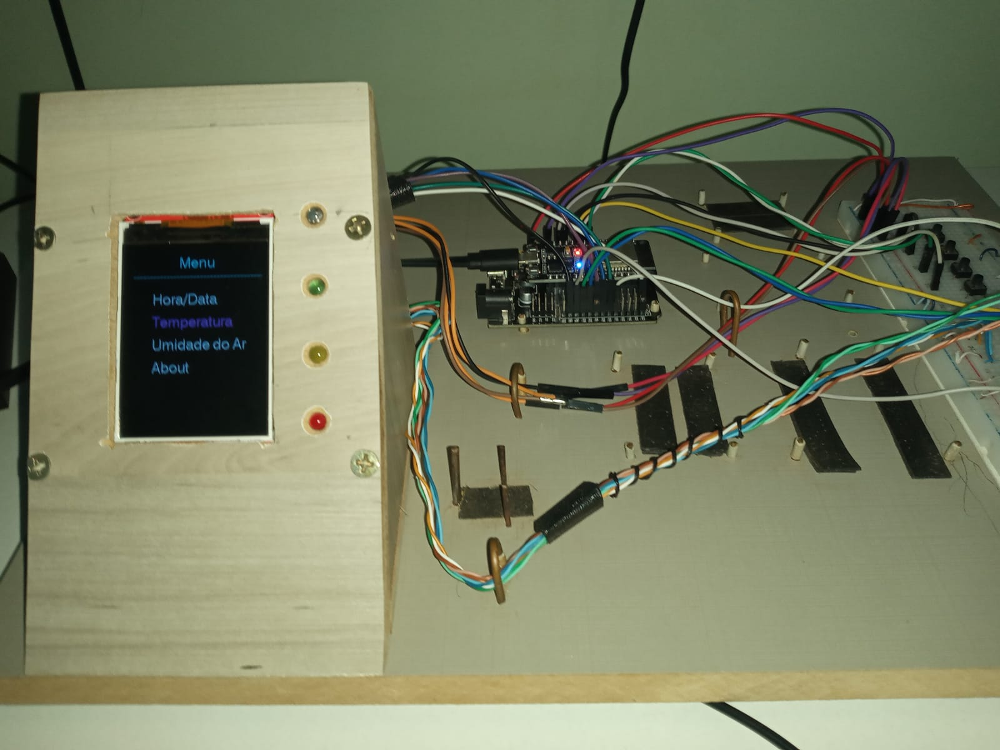
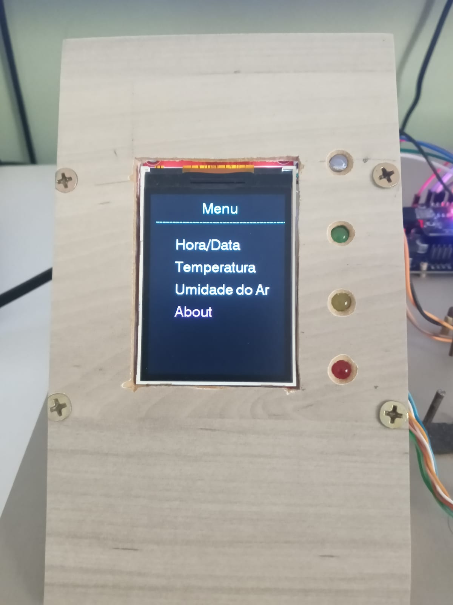
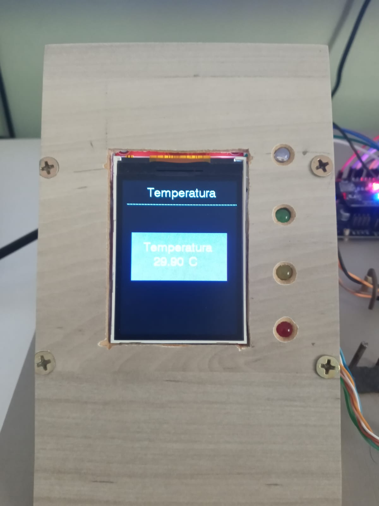
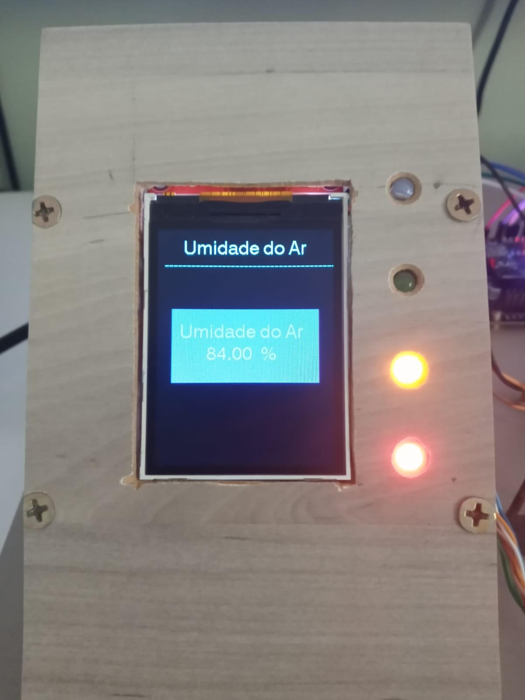
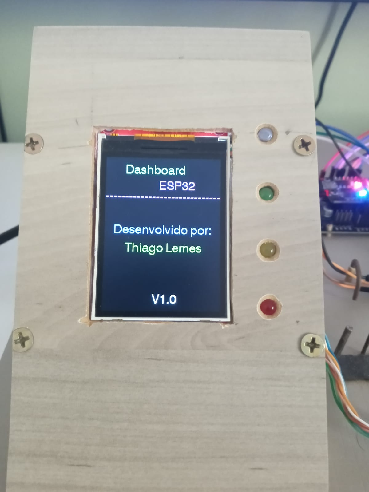
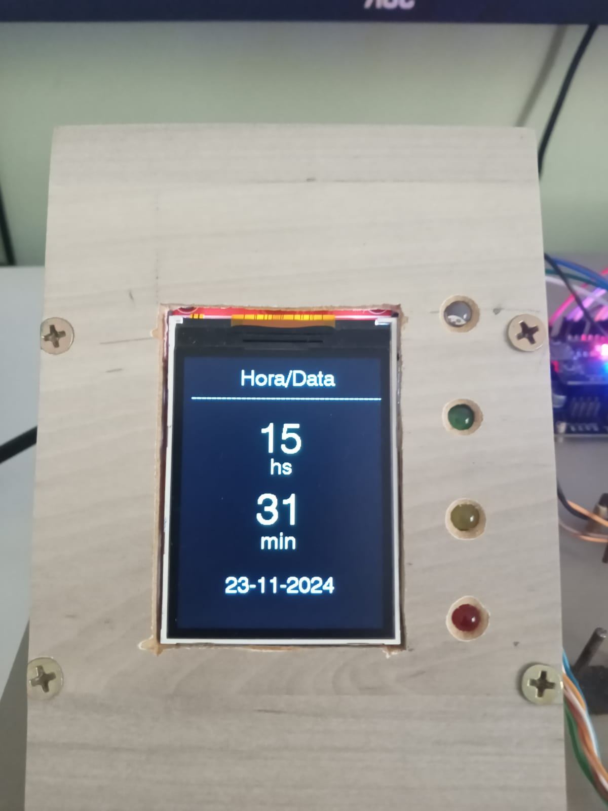

# <b>Projeto de Menu para LCD 24" TFT SPI com ESP32 na PlatformIO</b> - Sistemas Embarcados

<!-- TABLE OF CONTENTS --> 

  
Indície

  <ol>
    <li>
      <a href="#objetivo">Objetivo</a>
    </li>
    <li>
      <a href="#pastas-e-arquivos">Pastas</a>
    </li>
    <li>
      <a href="#imagens">Imagens</a>
    </li>
    <li>
      <a href="#sobre">Sobre</a>
    </li>
  </ol>

<!-- objetivo -->
## Objetivo

Este repositório tem como objetivo criar um modelo de Menu para ser exibido em um <b>LCD 24" TFT SPI</b>.
 
Será exibido a <b>Data</b> e <b>Hora</b>, <b>Temperatura</b> e <b>Umidade do Ar</b> coletados de um sensor <b>DHT11</b> e uma tela <b>About</b>.

Foi utilizado a extensão <b>PlartformIO IDE</b> no <b>VSCode</b> e a linguagem de programação <b>C/C++</b> para o desenvolvimento do mesmo.

<!-- pastas-arquivos -->
## Pastas e Arquivos

A estrutura básica das pastas são:

* <b>/data</b> - contém o arquivo <b>/config/example_configurations.json</b> que deverá ser renomeado para <b>configurations.json</b> com as configurações do nome da rede Wi-Fi e a Senha;
* <b>/src</b> - contém os códigos fontes.

Os arquivos contidos na pasta <b>/src</b> são:

* <b>main.cpp</b> - arquivo principal;
* <b>config.cpp</b> - arquivo que contém a função para fazer a leitura do arquivo <b>configurations.json</b> e capturar os dados da rede Wi-Fi;
* <b>utils.cpp</b> - contém duas funções para, capturar a <b>Temperatura</b> e <b>Umidade do Ar</b>, e configurar 4(quatro) <b>LEDs</b>.

<!-- Imagens -->
## Imagens

<h4>Mesa de Desenvolvimento</h4>

<h4>Menu</h4>

<h4>Temperatura</h4>

<h4>Umidade do Ar</h4>

<h4>About</h4>

<h4>Data e Hora</h4>

<!-- sobre -->
## Sobre

Autor: Thiago Vilarinho Lemes  
LinkedIn <a href="https://www.linkedin.com/in/thiago-v-lemes-b1232727" target="_blank">Thiago Lemes</a> 
Home <a href="http://thiagolemes.free.nf" target="_blank">Thiago Vilarinho Lemes</a> 
e-mail: contatothiagolemes@gmail.com | lemes_vilarinho@yahoo.com.br 

